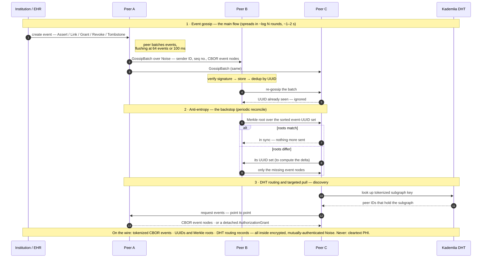

# Creda

**Creda** is a decentralized, peer-to-peer substrate for **cross-institutional patient
identity provenance** and **portable authorization** in US healthcare.

Institutions run peers that form a vetted-but-uncoordinated network. A directed acyclic
graph (DAG) of signed events records two co-primary things: **who a patient is** —
identity continuity across institutions — and **what they have authorized** — portable,
revocable, verifiable-at-point-of-use authorization. The graph replicates asynchronously
via gossip and anti-entropy. **FHIR R4** is the integration surface. There is admission
control (a vetted trust framework, modeled on DirectTrust) but **no runtime coordinator**:
once admitted, peers operate directly with one another.

Creda is complementary infrastructure. It does **not** replace institutional Master
Patient Indexes (MPIs), EHRs, or QHIN-mediated exchange. It fills a gap those systems
leave open: cross-institutional identity with cryptographic provenance, plus persistent,
revocable authorization that stays verifiable after data has moved — without a central
authority or vendor lock-in.

> The name *Creda* derives from the Latin for "to believe / to trust" — fitting for an
> identity-provenance system.

## Status

> **Pre-launch — all milestones implemented; hardening in progress.** The
> [technical specification](docs/creda-technical-spec.md) (Sections 1–13 + appendices, ~81
> pages) is complete and authoritative. All ten build milestones (M0–M9) are implemented:
> the full Rust spine (event model → storage → graph reasoning → networking → Core daemon),
> the dual-control Export Gate and Verifier, the HAPI FHIR Bridge, deployment packaging, and
> the conformance suite with its synthetic-data generator. The default workspace build and
> tests pass; the per-milestone table below records what is verified versus what is
> feature-gated and still being reconciled.
>
> This is **pre-launch software**: not yet deployed to a real network and not yet
> independently security-reviewed. Do not use it with real PHI.

<!-- Build-status badges go here once CI is wired to the remote. -->

Beyond the milestones, the in-daemon **gRPC serve socket** (Bridge ↔ Core over a Unix
domain socket) and the **libp2p transport ↔ engine replication** path (signed-event ingest
with mandatory signature verification, gossip publish, anti-entropy) are wired. The
replication orchestration is transport-agnostic and unit-tested in the default build; the
libp2p adapter itself remains an opt-in, separately-reconciled module (see *Verification*).

## Architectural thesis

- **Verification, not mediation.** Creda verifies identity and authorization claims; it
  does not sit in the data path or broker transactions. There is no central node that
  sees PHI.
- **Provenance by structure.** Every assertion is a signed event with parent references.
  The DAG *is* the audit trail — tamper-evident by construction.
- **Append-forward, content-mutable by exception.** History is structurally append-only;
  the right to be forgotten is honored by *tombstoning* (scrubbing PII content while
  preserving graph topology), distinct from authorization revocation.
- **Portable authorization is co-primary.** A grant is a signed, scoped, detachable
  artifact that travels with data references and is re-verifiable at any point of use —
  enforced by **dual control**: an Export Gate at the source and a Verifier at the
  relying party, neither able to unilaterally circumvent authorization.
- **Standards over invention.** The system is assembled from mature components (libp2p,
  HAPI FHIR, RocksDB/libgit2, the `pqcrypto` family, SPIRE, cert-manager, TEFCA
  tokenization). Only the healthcare-domain layer is new code. See spec **Appendix C**.

## What peers exchange

Three distinct kinds of exchange flow between Creda peers. They are worth separating because
they carry different things — and because none of them ever carries cleartext PHI.

**1. Event gossip (the main flow).** When an institution creates an event — a new identity
assertion, a link, an authorization grant, a revocation, a tombstone — its peer pushes that
event to a handful of neighboring peers, who push it onward, spreading it across the network in
roughly log(N) rounds (about 1–2 seconds network-wide). What is on the wire is a *batch* of
event nodes serialized in canonical CBOR, inside an encrypted Noise channel. Each batch carries:

- the sender's peer ID,
- a batch sequence number (for deduplication), and
- the serialized events themselves.

Batches flush every 100 ms or when they reach 64 events, whichever comes first — amortizing
encryption and framing overhead and cutting message count 10–50× versus sending events one at a
time. Each event node inside a batch contains its UUIDv7 (the address), the event type, parent
UUIDs (the edges of the graph), the payload, the originating institution's signature,
timestamps, and a logical clock. Critically, the payload carries **tokenized demographics, never
cleartext PHI** — cleartext patient data never traverses the gossip network by design. Receiving
peers verify the signature, store the event, and re-gossip it; they ignore any event UUID they
have already seen.

**2. Anti-entropy (the backstop).** Gossip is best-effort, so peers periodically reconcile. Two
peers holding the same patient's subgraph exchange a Merkle root computed over their *sorted set
of event UUIDs* — deliberately not over event contents, so tombstoning (which mutates content)
never makes two peers with the same event set diverge. If the roots match, they are in sync and
nothing more is sent. If they differ, they exchange the UUID sets each holds, identify the
delta, and transfer only the missing event nodes. This is how anything gossip dropped — during a
partition, an outage, or message loss — eventually gets caught.

**3. DHT routing and targeted pulls (discovery).** To find who holds a given patient's events,
peers exchange DHT records that map a *tokenized* subgraph key to peer IDs — again, tokens, not
demographics. Once a peer learns which peers hold a subgraph, it makes a targeted
point-to-point request for the actual event nodes. A **Portable Authorization Artifact** (a
signed `AuthorizationGrant` in CBOR) can travel this way too — detached and handed to a relying
party so it can verify authorization locally.

**What never crosses the wire.** Cleartext PHI. Demographics are tokenized before anything is
gossiped, the DHT only ever sees tokenized keys, and clinical payloads never enter the trust
graph at all. Everything that moves between peers is one of: a signed CBOR event node (with
tokenized content), a set of UUIDs and Merkle roots for reconciliation, or DHT routing records —
all inside encrypted, mutually-authenticated Noise channels.

The three exchanges, in sequence:



## Technology at a glance

| Layer | Choice |
|---|---|
| Core / Export Gate / Verifier | **Rust** |
| FHIR Bridge | **Java/Kotlin** — HAPI FHIR, Plain Server mode (not JPA) |
| FHIR version | **R4** (R5 deferred — open question 13.6.1) |
| Networking | **libp2p** — gossipsub, Kademlia DHT, Noise transport |
| Storage | `Store` trait — **RocksDB** impl first, **libgit2** scaffolded (open question 13.1) |
| Serialization | **Canonical CBOR** (ciborium, RFC 8949 deterministic encoding) |
| Hashing | **Blake3** |
| Node IDs | **UUIDv7** |
| Signatures | **Algorithm-agile** — Ed25519 default; ML-DSA-65 (FIPS 204) and SLH-DSA (FIPS 205) for PQC; hybrid mode |
| Identity | **UDAP** (institutional) + **SPIFFE/SPIRE** (workload), cert-manager rotation |
| Deployment | **Helm** chart primary; **Docker Compose** for laptop; Operator deferred |
| License | **Apache 2.0** |

## Repository layout

See [`REPO_STRUCTURE.md`](REPO_STRUCTURE.md) for the full map. In brief: the Rust
workspace lives in `crates/`, the FHIR Bridge in `bridge/`, deployment artifacts in
`deploy/`, the conformance suite and synthetic-data generator in `conformance/`, and all
specification documents in `docs/`.

## Build milestones

The build proceeds in strict dependency order (full detail in
[`docs/COWORK_BUILD_GUIDE.md`](docs/COWORK_BUILD_GUIDE.md)):

| Milestone | Component | Spec sections | Status |
|---|---|---|---|
| M0 | Repo init + CI | §12.2.2 | Done |
| M1 | Event model (`creda-events`) | §3, §4, §5 | Implemented · tests green |
| M2 | Storage (`creda-store`) | §5.2, §7.3, App. C | Implemented · tests green (incl. RocksDB) |
| M3 | Graph / computation (`creda-graph`) | §5.2.4, §4.6, §5.3 | Implemented · tests green |
| M4 | Networking (`creda-net`) | §6, §7 | Pure logic green; libp2p adapter opt-in (reconciling) |
| M5 | Creda Core (`creda-core`) | §10.1 | Implemented · tests green |
| M6 | Export Gate + Verifier | §4.5, §10.2, §10.3 | Implemented · tests green |
| M7 | FHIR Bridge (`bridge/`) | §8, §10.4 | Builds green; FHIR↔CBOR mappers are stubs |
| M8 | Deployment (`deploy/`) | §10.5, §10.6, §11 | Manifests authored; runtime verify on the test bed |
| M9 | Conformance + synthetic data (`conformance/`) | §11.4 | Implemented · tests green |

Verified by component: the default workspace (M1–M6, M9, plus the replication core) builds
and tests green via `anchor creda` (or `make test`); the opt-in **gRPC** server via `make
grpc`; the **FHIR Bridge** via `make bridge`. The shipped **libp2p** feature set
(`make libp2p`) is the one quarantined surface still being reconciled against the pinned
libp2p version, and is deliberately kept out of CI so its API churn never blocks the
workspace. End-to-end multi-peer deployment (Helm on kind/k3d, gossip convergence,
anti-entropy, revocation latency) is exercised in the test bed under `testbed/`.

## Building

The only host prerequisite is **Docker**: every task runs inside the dev container, so no
one installs a Rust toolchain, protoc, or a JDK by hand (see
[`docs/DEVELOPMENT.md`](docs/DEVELOPMENT.md)).

```sh
anchor creda      # build + test the whole default workspace, one rolled-up summary (= make anchor)
make grpc         # build + lint + test the opt-in gRPC server (feature `grpc`; needs protoc)
make libp2p       # compile-check the shipped feature set (gRPC + libp2p) — libp2p reconciliation
make bridge       # build the HAPI FHIR Bridge (Java/Kotlin) in a Gradle + JDK container
```

The default build is intentionally free of the heavy, version-volatile dependencies
(libp2p, tonic/protoc, the JVM bridge): those live behind features and separate targets so
`anchor creda` stays fast and always green. With a local toolchain the workspace also builds
the ordinary way (`cargo build --workspace` / `cargo test --workspace`). Local multi-peer
development uses Docker Compose under `deploy/compose/`, and the multi-peer test bed lives
under `testbed/`.

## Security and data handling

This is healthcare infrastructure. **Never commit secrets, credentials, or real PHI** —
all testing uses the synthetic data generator (M9) with `test-data` tagging so synthetic
events are provably invisible to clinical FHIR queries. Vulnerability reports route to a
private channel; see [`SECURITY.md`](SECURITY.md). The security model (UDAP + SPIFFE dual
credential, mandatory signature verification on replication, authorization enforcement at
the responding peer, and dual-control) is load-bearing — see spec §9.

## Contributing

Contributions are welcome under the spec-first, conformance-driven model described in
[`CONTRIBUTING.md`](CONTRIBUTING.md). Read the relevant specification section before
writing code for a component, and cite it in your commits.

## License

Licensed under the [Apache License 2.0](LICENSE). Open source is a precondition of the
design (spec §12.2.2): it enables independent security review, standards-body acceptance,
and freedom from vendor lock-in.
